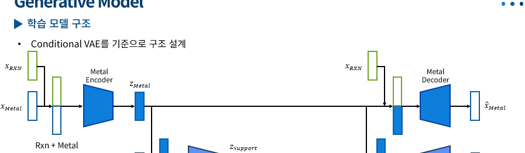

# Conditional Variational Autoencoder (CVAE) Project

본 프로젝트는 **촉매 조성 데이터**를 기반으로 한 **Conditional Variational Autoencoder (CVAE)** 
구현 및 학습 파이프라인을 정리<br>
금속 조성(metal)을 생성 대상 변수 `x`로 두고, 반응 조건(reaction) 등을 조건 변수 `c`로 사용하여 **조건부 생성 모델**을 생성


---

## 1. 프로젝트 구조

```
.
├── data/
│   ├── metal.npy           # 생성 대상 변수 X
│   ├── support.npy         # 보조 입력 (현재 미사용)
│   ├── pretreatment.npy    # 전처리 조건 (현재 미사용)
│   └── reaction.npy        # 조건 변수 C
│
├── model_vae.py             # CVAE 모델 및 loss 정의
├── vae_earlystopping.py     # 학습 스크립트 (EarlyStopping 포함)
├── earlystopping_optim.ipynb
├── optim.ipynb
├── 1_12_data_save.py        # CSV → npy 변환 스크립트
└── README.md
```

---

## 2. 데이터 준비

### 2.1 원본 데이터

* 원본 파일: `211210-DRM-total.csv`
* 각 컬럼 의미

| 구분           | 설명     | 차원 |
| ------------ | ------ | -- |
| metal        | 금속 조성  | 24 |
| support      | 지지체 조성 | 45 |
| pretreatment | 전처리 조건 | 6  |
| reaction     | 반응 조건  | 9  |

### 2.2 numpy 파일 생성

```bash
python 1_12_data_save.py
```

실행 결과로 `data/` 폴더에 `*.npy` 파일 생성

---

## 3. 데이터 분할 (No Shuffle)

본 프로젝트에서는 **데이터 순서에 의미가 있을 수 있다고 가정**하여 sklearn 분할 시 셔플을 사용X

```python
from sklearn.model_selection import train_test_split

# 60% train / 20% val / 20% test
x_train, x_tmp, c_train, c_tmp = train_test_split(
    x_data, c_data, test_size=0.4, shuffle=False
)

x_val, x_test, c_val, c_test = train_test_split(
    x_tmp, c_tmp, test_size=0.5, shuffle=False
)
```

이후 PyTorch Tensor로 변환

---

## 4. DataLoader 구성

```python
from torch.utils.data import TensorDataset, DataLoader

train_dataset = TensorDataset(x_train, c_train)
val_dataset   = TensorDataset(x_val, c_val)

tain_loader = DataLoader(train_dataset, batch_size=64, shuffle=True)
val_loader   = DataLoader(val_dataset, batch_size=64, shuffle=False)
```

* `train_loader` : 미니배치 학습용 (셔플 O)
* `val_loader`   : 검증용 (셔플 X)

---

## 5. CVAE 모델 구조 (`model_vae.py`)

### 5.1 Encoder

[ q_\phi(z | x, c) ]

* 입력: `[x, c]` concat
* 출력: latent 평균 `μ`, 로그분산 `logσ²`

### 5.2 Reparameterization Trick

```python
z = mu + std * eps
```

### 5.3 Decoder

[ p_\theta(x | z, c) ]

* 입력: `[z, c]` concat
* 출력: 재구성된 `x_hat`

---

## 6. Loss 함수

```python
def cvae_loss(x_hat, x, mu, logvar, beta=1.0):
    recon = F.mse_loss(x_hat, x)          # 전체 평균 MSE
    kl = -0.5 * torch.sum(
        1 + logvar - mu.pow(2) - logvar.exp(), dim=1
    ).mean()
    return recon + beta * kl, recon, kl
```

* **Reconstruction Loss**: 전체 원소 평균 MSE
* **KL Divergence**: 배치 평균
* `β`로 regularization 강도 조절

---

## 7. Early Stopping

```python
class EarlyStopping:
    def __init__(self, patience=20, min_delta=0.0):
        ...
```

* Validation loss가 `patience` epoch 동안 개선되지 않으면 학습 중단
* 최적 모델 가중치를 메모리에 저장

---

## 8. 학습 흐름 요약

1. 데이터 로드 및 분할
2. `TensorDataset` / `DataLoader` 생성
3. CVAE 모델 초기화
4. Train loop

   * `model.train()`
   * loss = recon + β·KL
5. Validation loop

   * `model.eval()` + `torch.no_grad()`
6. Early Stopping 적용

---

## 9. 향후 확장 아이디어

* support / pretreatment 조건 추가 (multi-condition CVAE)
* β-VAE 스케줄링
* latent space에서 조성 탐색 및 inverse design
* 조건 `c`를 embedding으로 처리

---

## 10. 요약

본 프로젝트는 **조건부 생성 모델(CVAE)** 을 촉매 조성 데이터에 적용하기 위한 기본적이고 정석적인 구현
데이터 분할, loss 스케일, validation 관리 등 **실험 재현성과 해석 가능성**을 중시하는 구조
